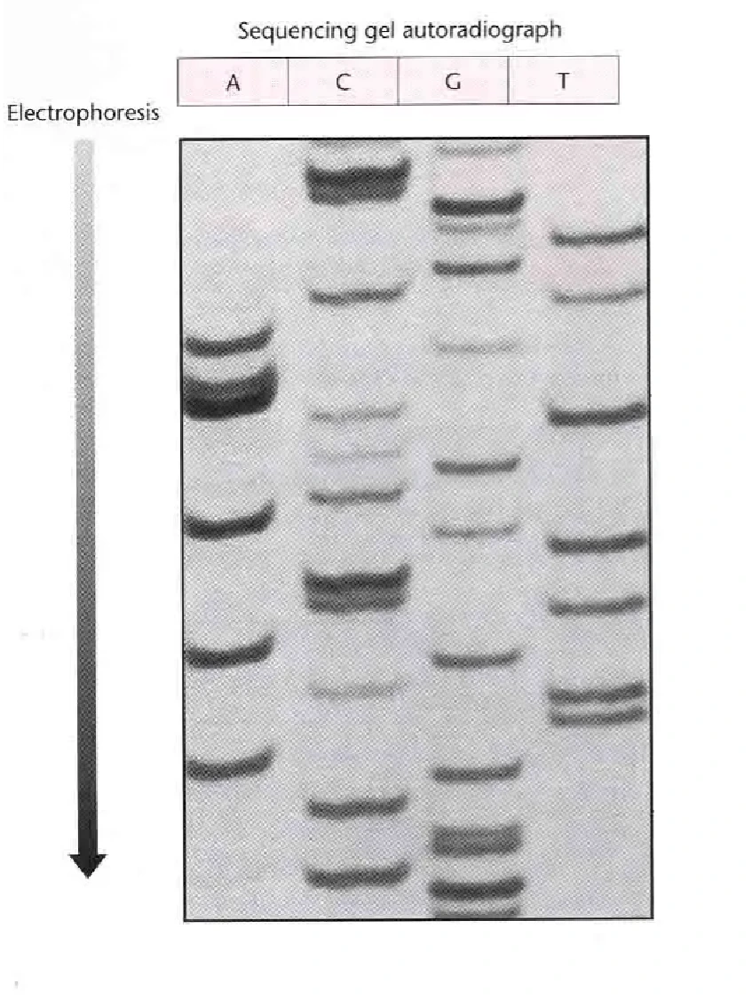

## mcqs

- 体外长期保存活细胞的方法。
  - [x] 液氮冻存
  - 4℃冷藏
  - -20℃冷冻

---

- 细胞计数板四个角每个大格的体积。
  - [x] 0.1 mm³
  - 0.01 mm³
  - 1 mm³

---

- 封闭的目的是什么？
  - [x] 减少非特异性结合
  - 增加抗体特异性
  - 去除背景信号

---

- 哪个不是Ⅱ型限制性核酸内切酶的识别序列？
  - [x] 类似于 ATGGTA 的序列
  - GAATTC（EcoRI 识别序列）
  - AAGCTT（HindIII 识别序列）

---

- PCR 反应体系中哪个成分用于延伸？
  - [x] DNA 聚合酶
  - dNTP
  - 引物

---

- Western blot 中哪一步用于检测目标蛋白？
  - [x] 抗体孵育
  - 电泳分离
  - 转膜

---

- 质粒小提实验中，Solution I 在使用前应加入什么？
  - [x] RNase
  - 蛋白酶
  - 溶菌酶

---

- PCR 产物纯化时，SPW Wash Buffer 第一次使用前应加入什么？
  - [x] 无水乙醇
  - 异丙醇
  - 甲醇

---

- 关于提纯一种含有较多带负电氨基酸的蛋白质的说法，错误的是：
  - 可以使用组氨酸标签亲和层析
  - 可以使用凝胶过滤层析根据分子大小分离
  - [x] 降低 pH 使蛋白带负电，用阳离子交换柱分离
  - 调高 pH 使蛋白带负电，用阴离子交换柱分离

---

- 有关电泳的说法，正确的是：
  - 配制 1% 的 50 mL 琼脂糖凝胶要称量 5 g 琼脂糖
  - 不需要点 DNA marker
  - PCR 产物鉴定上样不用加缓冲液
  - DNA 从正极向负极移动
  - [x] 电泳刚开始时会出现气泡

---

- 有关细菌转染实验的说法，错误的是：
  - [x] RNA 可以稳定地转染到细菌中
  - DNA 可以转染到细菌中
  - 质粒可以在细菌中复制

---

- 细胞转染实验中，为什么转染完成后要弃去转染试剂？
  - [x] 防止对细胞造成毒副作用
  - 为了节约试剂
  - 为了增加转染效率

---

- 动物细胞培养的条件。
  - [x] 37℃，5% CO₂
  - 37℃，空气
  - 25℃，5% CO₂

---

- 下列说法错误的是：
  - [x] 聚丙烯酰胺凝胶的孔隙要比琼脂糖凝胶大得多，更适合分离蛋白质
  - 聚丙烯酰胺凝胶用于蛋白质分离
  - 琼脂糖凝胶常用于核酸分离

## flashcards

> 共 5 题排序题，3 题计算题，3 题分析题。

- 请将以下 DH5α 细菌转化实验步骤按正确顺序排列（选项中写作“感受态 BL21”）：
    A. 取感受态 BL21，冰上解冻；
    B. 感受态细胞中加入质粒；
    C. 共孵育 30 min；
    D. 热击 90 s，冰上冷却 2 min；
    E. 加入液体培养基，37℃ 振荡培养 45 min。
  - 正确顺序为：A → B → C → D → E。

---

- 请将以下质粒小提实验步骤按正确顺序排列：
    A. 离心细胞；
    B. 重悬、裂解、中和；
    C. 离心取上清过柱；
    D. 洗涤；
    E. 洗脱质粒。
  - 正确顺序为：A → B → C → D → E。

---

- 蛋白 A 约 20 kDa，抗体约 90 kDa，二者形成蛋白 A—抗体复合物。请判断各组分经排阻色谱分离的先后顺序。
  - 先洗脱出抗体（约 90 kDa），然后是蛋白 A—抗体复合物，最后是蛋白 A（约 20 kDa）。即分子量大的先被洗脱。

---

- 请将以下分子克隆实验步骤按正确顺序排列：
    A. PCR 产物提取
    B. PCR
    C. 模板提取
    D. 产物和质粒连接
    E. 质粒测序、生物信息学分析
    F. 筛选、提取质粒
    G. 连接产物导入细菌
  - 正确顺序为：C → B → A → D → G → F → E。

---

- 请将以下细胞传代实验步骤按正确顺序排列：
    A. 用液体培养基吹下细胞
    B. 取一皿细胞，在显微镜下观察生长情况
    C. 用 PBS 洗涤三次
    D. 加入胰酶
    E. 将细胞悬液接种到新的培养瓶
  - 正确顺序为：B → C → D → A → E。

---

- 某基因的 cDNA 长度为 1503 bp，氨基酸平均分子量为 110 Da，计算该基因表达产物的分子量。
  - cDNA 长度为 1503 bp，则编码的氨基酸数为 1503 / 3 = 501 个。分子量约为 501 × 110 = 55110 Da。

---

- 使用浓度为 5 mg/mL 的原液，配制 250 mL、0.5 mg/mL 的溶液，计算所需原液的体积。
  - 根据 C₁V₁ = C₂V₂，5 × V₁ = 0.5 × 250，解得 V₁ = 25 mL。

---

- 细胞计数时共有 200 个细胞，其中 70 个被染成蓝色，计算细胞活力百分比。
  - 活细胞数 = 200 - 70 = 130。细胞活力 = (130 / 200) × 100% = 65%。

---

- 根据下图所示的桑格测序结果，写出 DNA 序列。
  - 5'-GGCGG CGATT CGATC CTGAC GCTCA AGATC GTGGC CGC-3'

---

- 研究人员发现了一种新蛋白 CasX，将其导入 HeLa 细胞，现需检测其是否表达，但市面上没有这种蛋白的特异性抗体。研究人员将 CasX 基因与表达 GFP 的基因连接后导入 HeLa 细胞。请写出检测该蛋白的 Western blot 实验步骤。
  - 
    (1) 收集转染后的 HeLa 细胞，裂解并提取总蛋白。
    (2) 进行 SDS-PAGE 电泳分离蛋白质。
    (3) 将凝胶上的蛋白质转印至 PVDF 或硝酸纤维素膜。
    (4) 用封闭液（如脱脂牛奶或 BSA）封闭膜，以减少非特异性结合。
    (5) 使用抗 GFP 的一抗（因为 CasX 与 GFP 融合表达）孵育膜，使抗体与目标蛋白结合。
    (6) 洗涤后，加入 HRP 或荧光标记的二抗孵育。
    (7) 再次洗涤，加入相应底物进行显色或化学发光检测。若在预期分子量位置（CasX-GFP 融合蛋白大小）检测到信号，则表明 CasX 蛋白已成功表达。

---

- 细胞划痕实验为什么要弃去原来的培养基？为什么要使用无血清培养液？
  - 弃去原来的培养基是为了去除细胞碎片和漂浮的死细胞，并清除可能干扰实验的旧培养液成分。使用无血清培养液是为了排除血清中生长因子等成分对细胞迁移的影响，确保实验结果的可靠性。