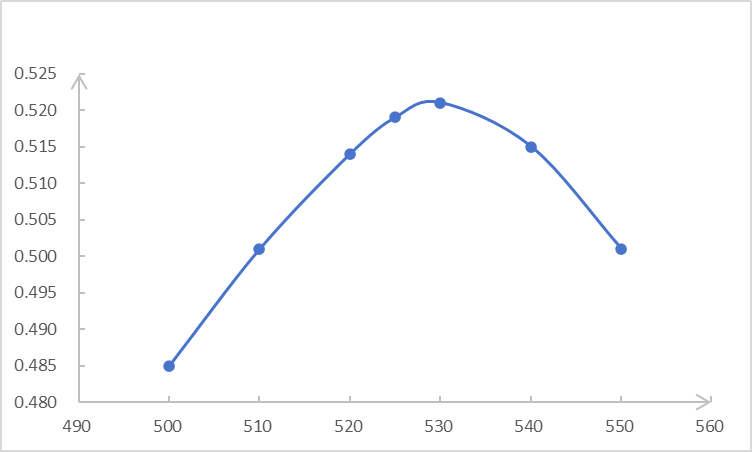

## flashcards

> 本部分为填空题与简答题，请根据各题要求作答。

- 化学品安全技术说明书的英文缩写是 ____。
  - MSDS

---

- pH = 10.85 的有效数字是 ____。化学实验中，偏差反应的是实验的 ____，误差反应的是 ____（以上两空填入：准确度/精密度/灵敏度）。多次取平均可以最小化 ____，用同一个设备可以最小化 ____（以上两空填入：系统误差/随机误差/过失误差）。
  - 两位；精密度；准确度；随机误差；系统误差

---

- 测定自制乙酰水杨酸中水杨酸总酸度测定中，采用的滴定溶液是 ____，该溶液采用 ____（填入化学名称）进行标定。实验要求滴定前在锥形瓶中加入 30 mL 蒸馏水，某同学多加了 20 mL，对实验结果的影响是 ____（偏大、偏小、几乎不变）。
  - NaOH 标准溶液；邻苯二甲酸氢钾；几乎不变

---

- 在制备三草酸合铁(III)酸钾实验中，发生了什么类型的化学反应：____，____，____ 和酸碱反应。甲同学蒸发三草酸合铁(III)酸钾时候发现溶液浑浊，并且有黄色沉淀产生，可能的原因是 ____。乙同学发现最终的产品有白色颗粒，可能的原因是 ____。
  - 氧化还原反应；复分解反应；配位反应；加热过度导致配合物分解产生氢氧化铁沉淀；未完全溶解的草酸钾或氯化钾晶体

---

- 在化学反应速率和活化能测定中，探究浓度对化学反应速率的影响时加入硫酸钾与硝酸钾的作用是 ____。加入水后，反应速率的变化是 ____（增大，减小，不变）。有同学发现反应溶液变蓝一段时间后溶液变为棕黄色，原因是 ____。
  - 保持反应体系离子强度和总浓度不变；减小；过量的碘离子被空气中的氧气氧化为碘单质

---

- 采用薄层色谱进行定性分析依据是 ____，实验采用的硅胶 GF₂₅₄ 中 F₂₅₄ 指的是 ____，采用的粘结剂是 ____。
  - 比较未知物与标准物在相同条件下的比移值 (Rf 值)；含 254 nm 波长下具有荧光的指示剂；羧甲基纤维素钠 (CMC-Na)

---

- 电镀铜实验中采用的电镀液主要成分是 ____（化学式），在电镀过程中，待镀件作 ____ 极，用作镀层的金属板作 ____ 极。
  - CuSO₄；阴；阳

---

- 在制取手工皂的实验中，有同学想用紫甘蓝提取液制作出蓝色的手工皂，老师说这不可能，因为____。
  - 手工皂（油脂与 NaOH 反应）呈碱性，紫甘蓝指示剂在碱性条件下显示绿色或黄色，不会显示蓝色。

---

- 本学期实验中用了两个离子选择电极，分别是 ____，__。其各自的个核心部件分别是 ____，__。
  - 氟离子选择电极；pH 玻璃电极；氟化镧单晶膜；玻璃敏感膜

---

- 测定果蔬中维生素 C 含量的实验里，测定维生素 C 含量用的滴定标准溶液成分是 ____，其在碱性条件下是 ____ 色，在碱性条件下是 ____ 色。实验中用到的仪器有研钵，过滤用的烧杯，容量瓶，锥形瓶，滴定管，移液管，其中 ____ 要求干燥，____ 要求进行润洗。
  - 2,6-二氯酚靛酚；蓝；无色；容量瓶；滴定管和移液管

---

- 在茶叶氟离子含量测定中采用了两种方法，分别是 ____ 和 ____。在氟离子标准溶液中加入了 ____，其有三个作用，分别是 ____，____ 和 ____。
  - 标准曲线法；标准加入法；总离子强度调节缓冲剂 (TISAB)；固定溶液的离子强度；掩蔽 Al³⁺、Fe³⁺ 等干扰离子；调节溶液的 pH 值

---

- 分析天平称量的三种方法是什么？分别适合什么情况？
  - (1) 直接称量法：适用于称量不易吸潮、不与空气反应的固体试样，如称量器皿或基准物质。2. 差减称量法（递减称量法）：适用于称取多份易吸湿、易氧化或易与 CO₂ 反应的样品。3. 固定质量称量法（增量法）：适用于称取某一固定质量的样品，常用于配制标准溶液。

---

- 蓝晒法的实验原理是什么？影响其成像质量的因素有什么？
  - 实验原理：利用柠檬酸铁铵和铁氰化钾在紫外光照射下发生光化学反应，生成不溶性的蓝色络合物（普鲁士蓝），未被光照的部分被水洗去，从而形成蓝色图像。影响因素：光照强度和时间、纸张类型、试剂配比、涂布均匀度、水洗时间等。

---

- 量气法测量理想气体常数 R 的实验中：(1) 为什么量气管读数的时候需要保持水准瓶中液面与量气管中液面水平。(2) 大部分同学 R 值偏小，可能的原因是？(3) 一部分同学的 R 值偏大，可能的原因是？(4) 如何检验装置的气密性？
  - (1) 为了使量气管内气体压力与外界大气压相等，避免液面差引入的附加压力造成读数误差。(2) 镁带未完全反应或酸不足；气体未冷却至室温就读数；量气管读数时未调平导致压力大于大气压。(3) 量气管刻度读数错误；镁带中含有与酸反应的其他杂质；装置漏气。(4) 连接好装置后，将水准瓶下移一段距离后固定，观察量气管中液面是否发生变化。若液面不变，则气密性良好。

---

- 在分光光度法测定自制乙酰水杨酸中残留水杨酸的实验中：(1) 分光光度计组成和各个部分功能。(2) 按照实验绘制图表的要求补全下图图表中的横、纵坐标标题与图表标题。(3) 依据图表，测定时候应该选取什么波长，理由是什么。(4) 已知测定溶液的摩尔吸光系数 ε = 1.7×10⁴ L·mol⁻¹·cm⁻¹，比色皿的厚度是 b = 1 cm，为了保证实验结果准确性，需要控制吸光度 A 在 0.2~0.7 的范围，则溶液的浓度应该在什么范围内？
  - (1) 光源（提供稳定的连续光谱）、单色器（分离出所需波长的单色光）、样品室（放置比色皿）、检测器（将光信号转换为电信号）、信号显示系统（显示或记录测量结果）。(2) 图表标题：水杨酸吸收光谱图；横坐标：波长 (nm)；纵坐标：吸光度 A。(3) 应选取最大吸收波长，约为 530 nm，因为在此波长处吸光度最大，测定灵敏度最高，且能够最大程度降低其他组分干扰。(4) 浓度范围为 c = A/(ε·b)，所以 c_min = 0.2/(1.7×10⁴ × 1) ≈ 1.18×10⁻⁵ mol/L，c_max = 0.7/(1.7×10⁴ × 1) ≈ 4.12×10⁻⁵ mol/L。

---

- 草酸亚铁难溶于水，其饱和溶液可以视为无限稀释溶液，已知其 Ksp，采用电导率法设计实验求草酸亚铁的 Λₘ∞，并写出相应的实验方案和计算过程。$$\ce{FeC2O4 \rightarrow Fe2+ + C2O4^{2-}}$$
  - 实验方案：
    (1) 制备草酸亚铁的饱和溶液，过滤得到澄清溶液。
    (2) 用电导率仪测定该饱和溶液的电导率 κ(溶液)。
    (3) 测定用于配制饱和溶液的去离子水的电导率 κ(水)。
    (4) 计算草酸亚铁的电导率 κ(FeC₂O₄) = κ(溶液) - κ(水)。
        计算过程：已知 Ksp = [Fe²⁺][C₂O₄²⁻] = s²，因此溶解度 s = √Ksp (mol/L)。溶液无限稀释时，摩尔电导率 Λₘ∞ = κ(FeC₂O₄) / c，其中 c 为草酸亚铁的摩尔浓度 (s)。因草酸亚铁为难溶强电解质，其饱和溶液浓度即为 s，所以 Λₘ∞ = (κ(FeC₂O₄) / s) × 1000 (S·cm²·mol⁻¹)，注意单位换算。