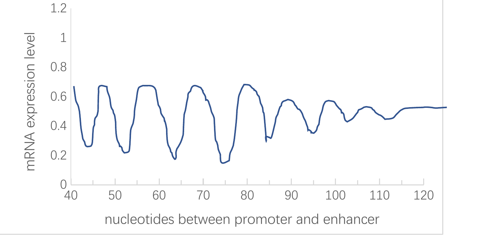

## mcqs

> 选择题（可确定答案的部分）

- The first step of gene expression is:
  - Replication
  - [x] Transcription
  - Translation
  - 都不是

---

- 一段关于孟德尔遗传的叙述中，孟德尔所说的“Character”用现代术语表示为：
  - [x] Gene
  - Genome
  - Allele
  - Locus

---

- Homologous recombination 发生在 meiosis 的哪个时期？
  - [x] Prophase I
  - Metaphase I
  - Prophase II
  - Metaphase II

---

- 蛋白质检测的方法。
  - Northern blot
  - RT-qPCR
  - Southern blot
  - [x] Immunofluorescence

---

- 人类基因组计划的目标。
  - [x] 测定人所有染色体的序列
  - 基因定位

---

- 有关 Hox 基因的说法。
  - [x] 是一系列功能相似的基因
  - 只在果蝇中

---

- 人类基因组概述。
  - [x] 人和人基因组相似程度 99.9%
  - 人和黑猩猩基因组相似程度
  - 人的基因中只有约 1.5% 编码蛋白质，其他是非编码 DNA
  - Y 染色体是最短的，上面的基因是最少的

---

- 孟德尔遗传定律不适用于什么？
  - [x] Mitochondrial disease
  - ?

---

- 以下谁没有获得第 82 届诺贝尔奖？
  - Paul Berg
  - Walter Gilbert
  - [x] William（其余姓名未能回忆）
  - Frederick Sanger

---

- 有关 homologous 的说法。
  - 人的前肢和海豹的前肢不是同源器官
  - 鸟的翅膀和蝙蝠的翅膀不是同源器官
  - [x] 同源器官是形态相似、来自共同祖先的器官

---

- 核小体由几个组蛋白构成？
  - 1
  - 4
  - [x] 8
  - 10

## flashcards

> 名词解释（共 8 题）

- French flag model
  - 法国国旗模型，用于解释形态发生素浓度梯度如何决定细胞命运，类似于法国国旗的三色区域对应不同浓度阈值诱导不同发育命运。

---

- Homologous
  - 同源的，指不同个体或不同部位在进化上来自共同祖先的结构（如人的前肢与海豹的前肢），或在遗传学中指序列相似、源于同一祖先的基因或染色体区域。

---

- Anticipation
  - 遗传早现，指遗传病在连续世代中发病年龄提前、病情加重的现象，常见于动态突变（如三核苷酸重复扩增）。

---

- Pedigree
  - 系谱图，用特定符号绘制家庭中成员患病情况、亲缘关系和遗传传递模式，用于遗传分析。

---

- Centimorgan
  - 厘摩（cM），遗传距离单位，表示两个基因座之间重组频率为 1% 时的距离。

---

- Mendel’s law of segregation
  - 分离定律，指等位基因在配子形成时彼此分离，每个配子只携带一对等位基因中的一个，受精后恢复成对。

---

- CRISPR
  - 规律成簇间隔短回文重复序列，一种原核生物的适应性免疫系统，现被改造为基因编辑工具（CRISPR‑Cas9），可定向切割DNA。

---

- Heterochromatin
  - 异染色质，染色质中高度压缩、转录活性低、复制时间晚的部分，多位于着丝粒和端粒区域。

---

> 简答题（共 4 题）

- Nucleosome 的组成和作用。
  - 核小体由约 146 bp DNA 缠绕在组蛋白八聚体（各两分子的 H2A、H2B、H3、H4）上构成，另有一个 H1 连接相邻核小体。作用是压缩 DNA 形成染色质基本单位，并参与调控转录、复制和修复。

---

- Commonalities and differences between Barr body and polar body.
  - 共同点：两者都是细胞中多余的遗传物质结构——Barr 体是 X 染色体失活形成的浓缩体，极体是卵细胞减数分裂产生的无功能小细胞。不同点：Barr 体存在于体细胞中，是转录失活的 X 染色体；极体存在于卵子形成过程中，是减数分裂产物，最终退化。

---

- 胚胎发育过程中的关键节点。
  - 主要节点包括：受精（合子形成）、卵裂（快速分裂）、桑葚胚、囊胚（内细胞团与滋养层分化）、原肠运动（三胚层形成）、神经胚（神经管形成）、器官发生（各器官原基建立）以及形态发生和组织分化。

---

- 某同学计划研究 A 基因增强子与启动子之间的距离对表达的影响，于是改变 Y 基因增强子和启动子之间的距离，并测定 mRNA 表达量，得到如下结果。请简要说明可能的原因。{: .exam-figure }
  - 可能原因：增强子与启动子的距离过远会降低两者通过染色质环化相互作用的效率，导致转录激活减弱；而过近可能干扰基础转录复合体的装配或产生空间位阻。图中所示的表达量随距离变化通常呈现“先升后降”或“平台”趋势，说明存在最佳距离范围，同时可能受到绝缘子、染色质状态或增强子‑启动子匹配性的影响。