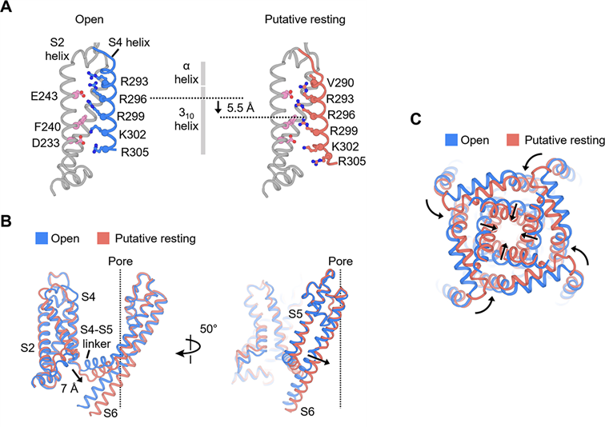
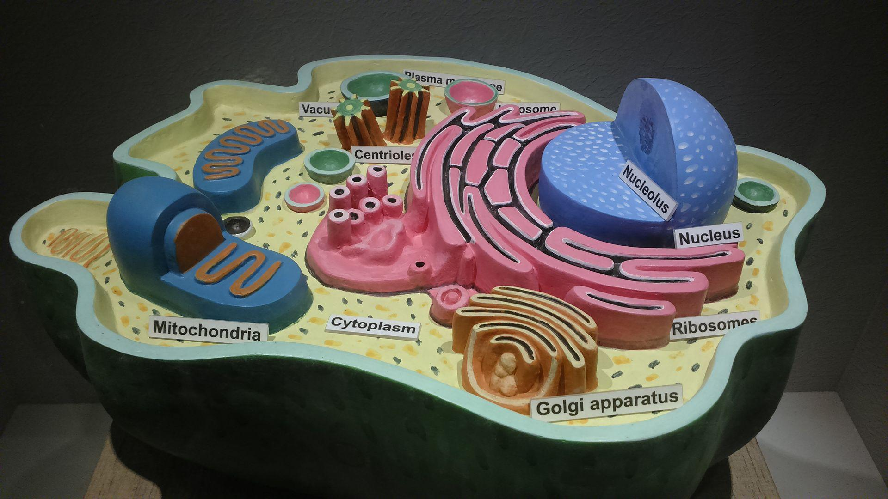

## mcqs

> 单项选择题，共 20 题，每题 1 分。

- 分子间作用力的量级为：
  - 1 N
  - 1 × 10⁻³ N
  - 1 × 10⁻⁶ N
  - 1 × 10⁻⁹ N
  - [x] 1 × 10⁻¹² N

---

- 以下哪个是单分子技术：
  - 光镊
  - 膜片钳
  - 磁镊
  - 原子力显微镜
  - [x] 以上都是

---

- 以下有关冠状病毒入侵受体细胞的生物力学的说法**错误**的是：
  - 冠状病毒入侵受体细胞的过程中存在生物力作用
  - 冠状病毒入侵受体细胞的过程中会感受到拉力和压力
  - [x] 冠状病毒刺突蛋白受力会减缓刺突蛋白和 ACE2 解离
  - 冠状病毒演化突变刺突蛋白的 RBD 区会降低刺突蛋白与 ACE2 的力学稳定性
  - 冠状病毒刺突蛋白受力，S1/S2 区域结合更稳定

---

- 下面关于力在各个尺度上的描述正确的是：
  - 分子间的作用力：范德华力、静电力
  - 细胞间的作用力：粘附力
  - 组织和器官尺度上的力学因素：受限空间、基质软硬度
  - 组织和器官尺度上的作用力：流、拉、扭、压
  - [x] 以上都是

---

- 下面关于吉布斯自由能的说法**错误**的是：
  - 系统的吉布斯自由能可由系统的焓和熵计算出
  - Δ_r G 取决于化学反应平衡常数和各物质的浓度
  - 标准状态下，ΔG° = - RT ln K
  - [x] 平衡状态时，ΔG = ΔG°
  - 吉布斯自由能变是吉布斯自由能的导数

---

- 下面有关 ATP 水解的描述说法**错误**的是：
  - ATP 水解释放出的能量的大小与 ATP / ADP 的浓度有关
  - [x] ATP 在线粒体基质中水解释放的能量更多
  - ATP 与 ADP 对向转运是主动运输
  - 与 ATP 水解偶联是很多热力学不利反应能发生的原因
  - 在体内 ATP 的水解和 pH、Mg²⁺ 浓度和磷酸基团水平有关

---

- 下列关于核磁共振说法正确的是：
  - 核自旋量子数 I 反映外加磁场方向的投影，反映了核自旋角动量空间取向的量子化
  - 磁量子数 m_I 反映核自旋角动量大小的量子化
  - 核磁共振只能用于氢核的检测
  - [x] 核磁距正比于 m_I
  - ¹H 拉莫尔频率与仪器精度成反比

---

- 下列关于核磁共振说法**错误**的是：
  - 核磁共振可以测定蛋白质的三维结构
  - 可以研究动态变化
  - [x] 不适用于大分子
  - 解析结构一般需要 ¹H-¹³C-¹⁵N 三谱联用，所以需要同位素标记的蛋白质
  - 通过实验和非实验约束可以确定唯一结构

---

- STRING 数据库提供：
  - 蛋白互作的证据
  - 蛋白互作的机理
  - 哪些蛋白有互作
  - [x] 蛋白互作的网络
  - 蛋白互作的文献

---

- 同源建模序列比对氨基酸一致性力求要达到：
  - 10%
  - 15%
  - 20%
  - [x] 30%
  - 25%

---

- 使用在线服务器可以获取：
  - 氨基酸的基本性质
  - 肽链的二级结构预测
  - 蛋白的跨膜结构域预测
  - 蛋白无固定结构域预测
  - [x] 以上都是

---

- 下面有关生物大分子的动态变化哪个时间尺度更大：
  - 氨基酸侧链上甲基的旋转
  - 化学键的拉伸振动
  - 蛋白质二级结构的形成
  - [x] 蛋白质三级结构的形成
  - 氨基酸侧链上甲基的旋转

---

- 下面哪个是线粒体膜间隙的标志酶：
  - 单胺氧化酶
  - [x] 腺苷酸激酶
  - 孔蛋白
  - 细胞色素氧化酶
  - ATP 合酶

---

- 线粒体运动的 Miro1 / Miro2 是：
  - ATP 酶
  - [x] GTPase 酶
  - 泛素化酶
  - 水解酶
  - （未回忆）

---

- p-tau217 是什么疾病的生物标志物（Biomarker）：
  - [x] 阿尔兹海默
  - 帕金森
  - 肌萎缩性脊髓侧索硬化症
  - 亨廷顿病
  - 多发性硬化

---

- 第一个宣告发现 GFP 的人是：
  - 格拉斯・普拉舍
  - [x] 下村修
  - 钱永健
  - 马丁·查尔菲
  - 弗兰克・约翰逊

---

- 以下哪个是线性马达：
  - [x] 肌球蛋白
  - RNA 聚合酶
  - DNA 聚合酶
  - ATP 合酶
  - 细菌的鞭毛马达

---

- 动力蛋白（dynein）在微管上运动方向是：
  - 正极
  - [x] 负极
  - 双向随机运动
  - 依靠微丝运动
  - （未回忆）

---

- 驱动分子马达步行的机制：
  - [x] 两条重链交替 ATP 水解
  - 轻链甲基化
  - 微丝的动态不稳定性
  - 钙离子波动
  - 膜电位变化

---

- tau 蛋白过度磷酸化导致 AD 的可能机制是：
  - 激活驱动蛋白
  - 抑制动力蛋白
  - 激活肌球蛋白在微丝上运动
  - [x] 破坏微管稳定性并影响线粒体运输
  - 激活线粒体自噬

## flashcards

> 简答题（共 6 题，每题 5 分）

---

- 简要说出两种单分子力学操作技术
  - 光镊和磁镊（或原子力显微镜）。

---

- 简要说出核磁共振技术在非结构生物学领域的应用
  - 研究生物大分子的动态变化、蛋白质-配体相互作用、代谢组学分析、药物结合位点鉴定、膜蛋白构象变化等。

---

- 简要说出生物成像技术在科学研究中的应用
  - 观察细胞和亚细胞结构、追踪蛋白质等分子的动态分布、研究疾病模型、监测药物作用效果、以及活体成像等。

---

- 简要说出超氧化物歧化酶的催化原理和生理学意义
  - 催化超氧阴离子自由基（O₂⁻）歧化为过氧化氢（H₂O₂）和氧气（O₂）；生理意义是清除活性氧，保护细胞免受氧化损伤，维持氧化还原平衡。

---

- 说出至少五个用于表征荧光物质的参数
  - 激发光谱、发射光谱、荧光量子产率、荧光寿命、荧光偏振（或各向异性）、斯托克斯位移等。

---

- 研究发现某新蛋白质为疾病发生的关键调控因子，具备成为治疗靶标的生物学特征。请简述该靶点蛋白的药物研发工作可以采用哪些计算生物学研究策略
  - 可采用同源建模或从头预测构建三维结构；分子对接和虚拟筛选发现候选小分子；分子动力学模拟评估结合稳定性；药效团模型和定量构效关系优化先导化合物；以及基于网络的靶点-疾病关联分析。

---

- 膜片钳技术的原理和记录方式
  - 原理：利用玻璃微电极与细胞膜形成高阻（吉欧级）封接，隔离膜片上的离子通道，在电压钳制下记录单个或群体离子通道的电流。记录方式包括：细胞贴附式、内面向外式、外面向外式、全细胞式、穿孔膜片钳等。

---

- 冷冻电镜技术解析生物样品结构的优点
  - 无需结晶，可解析近原子分辨率（2-4 Å）结构；适用于膜蛋白、大分子复合物和动态构象；样品保持在近生理状态的冷冻水合环境中；可同时获得多个构象状态；对样品纯度要求相对较低。

---

- Activation and closed-state inactivation mechanisms of the human voltage-gated KV4 channel complexes, Molecular Cell (Vol. 82, pp. 2427-2442) 报道了电压门控钾离子通道 Kv4.2 在不同状态下的结构：图 A 左侧 VSD 激活状态，右侧 VSD 静息状态；图 B 单个亚基关闭和开放状态下 VSD、S4-S5 linker、gate 的 S6 C 末端结构的比较；图 C 蓝色开放状态，橙色关闭状态。根据图片结合分析和比较，阐述 Kv4.2 的电压门控机理（图中所示的箭头为从开放状态转为关闭状态）。
  - 电压感受器（VSD）中的 S4 片段富含正电荷，感知膜电位变化。去极化时，S4 向外移动，通过 S4-S5 连接器牵拉 S6 段（门控），使通道开放；复极化时，S4 向内移动，S6 返回关闭构象，门控关闭。从开放到关闭（箭头方向），S4 内移，S4-S5 linker 松弛，S6 弯曲或扭转，孔道收缩，同时可能伴随 N-型或 C-型失活。

---

- 新发现一种海洋微生物可以在极端盐碱环境生存。其表面有特殊膜结构可以有效隔绝细胞内外，此外还发现参与物质运输和能量转换。进一步研究发现还可以对不同类型的物质有选择透过性，允许特定物质进入，阻止其他物质进入。（1）推测该特定膜结构最可能属于哪种膜，并解释依据。（2）结合该膜结构的功能，分析其在维持细胞内外环境稳态中发挥的作用。
  - （1）最可能属于细胞膜（质膜）。依据：具有隔绝内外、物质运输、能量转换和选择透过性，是细胞膜的基本功能。（2）通过选择透过性，允许离子和营养物质选择性进入，排出有毒离子（如 Na⁺）和代谢废物；参与质子梯度或离子梯度建立，驱动 ATP 合成；维持细胞内合适的离子浓度、pH 和渗透压，抵御外部高盐碱环境，保证代谢酶活性。